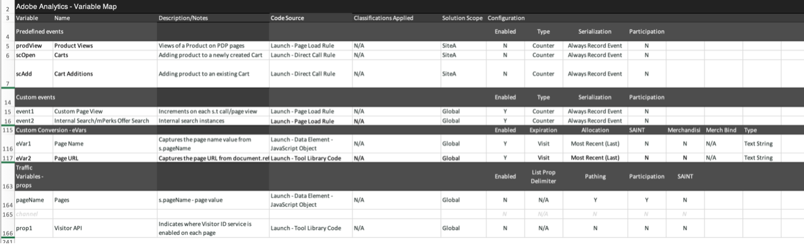

# Adobe Analytics 구현 Playbook 다운로드

시작하기 전에, [플레이북 다운로드](assets/aa-implementation-playbook.xlsx).

## 비즈니스 요구 사항 탭

**내용:** 비즈니스 요구 사항 문서(일반적으로 BRD라고 함)는 주요 이해 관계자, 비즈니스 사용자 및 기술 사용자가 공동으로 작업하려는 매우 중요한 문서입니다. 원하는 모든 KPI, 보고 요구 사항 및 Adobe Analytics(AA) 구현이 완료되는 시점을 확인할 데이터 포인트를 문서화하기 위한 곳입니다.

**이유:** SDR, 기술 사양 등 및 는 AA의 최종 상태에 합의되는 진실의 공통 원천입니다. 이 문서는 조직 내의 여러 팀 간에 생각을 정리하여 구축 또는 구현 향상을 위해 한 가지 유도 방향을 형성합니다.

**방법:** 비즈니스 요구 사항을 문서화하는 것은 AA의 최종 비즈니스 사용자가 일반적으로 수행하지만, 기술 사용자의 피드백을 받는 것이 중요합니다. 왜냐하면 메모에 기술적인 문제가 있을 수 있고 특정 데이터 포인트를 우선 순위 지정이라는 요인에 따라 다른 데이터보다 많은 노력이 필요할 수 있기 때문입니다.

&quot;사이트에서 추적하려는 사항은 무엇입니까&quot;, &quot;보고 사용 시 내게 중요한 데이터 포인트가 무엇입니까&quot;, 가장 중요한 것은 &quot;이러한 데이터 포인트가 결정 시 무엇을 알려줍니까&quot;입니다. 비즈니스 요구 사항 각각이 비즈니스 의사 결정을 알리는 데 사용할 수 있는 데이터 포인트와 관련이 있는지 확인하는 것이 중요합니다. 예를 들어 사이트에서 모든 클릭을 추적하려고 할 수 있지만, 하루가 끝날 때 해당 보고에서 어떤 통찰력을 얻을 수 있습니까?

먼저 아래 스크린샷에 열 C를 입력합니다(비즈니스 요구 사항). &quot;사이트에서 내부 검색을 완료하는 횟수&quot; 또는 &quot;노출 측면에서 가장 효과적인 내부 캠페인 스팟&quot;과 같은 것일 수 있습니다. 이 세부 사항을 입력한 후 다시 돌아가서 열 B(카테고리)를 입력하고 기술 사양 섹션과 잘 일치해야 하는 &quot;검색&quot; 또는 &quot;내부 프로모션&quot;과 같은 카테고리로 요구 사항을 그룹화할 수 있습니다.

또한 eVar, 이벤트, prop 또는 조합을 사용할 때 추적하려는 것이 성취될지 여부도 표시됩니다.

마지막으로, 사이트에 항목을 추가하기 시작할 때 구현 상태 열은 상태 확인으로 사용됩니다.

## 변수 맵 탭(문서/SDR 태깅)

**내용:** 태깅 문서(일반적으로 SDR이라고도 함)는 AA의 기술 및 비즈니스 사용자 모두에게 중요한 문서입니다. 보고서 세트에서 사용하는 모든 변수, 변수 설정에 대한 관련 세부 사항, 변수 구현 방법 및 보고 용도를 모두 나열합니다. 속성 설명서와 마찬가지로 태깅 개선 사항 또는 구현 변경 사항이 도입되면 최신 상태를 유지할 책임이 있는 담당자가 있는 잘 관리되는 Excel 문서여야 합니다.

**이유:** 이 문서는 많은 용도로 사용되지만 가장 중요한 사항은 다음과 같습니다.

* 구현을 처음 사용하는 사람(신규 고용, 사용 가능한 보고 등을 더 잘 이해하고자 하는 비즈니스 소유자) 이 문서에서는 구현된 모든 변수에 대한 최상의 보기와 AA 설정을 학습하는 측면에서 개인이 자체 서비스를 제공할 수 있는 변수의 목적을 설명합니다.
* AA 제품 소유자/기술 사용자의 경우 이 문서는 다른 변수가 설정되는 방식과 새 차원을 추가할 때 사용할 수 있는 변수를 미리 보는 역할을 합니다.

**방법:** 먼저 Excel 문서에 eVar, prop, event, list 변수를 비롯한 모든 Adobe 즉시 사용 가능한 변수(페이지, 제품, 지역 등)를 나열하십시오. 여기에는 사이트/보고서 세트당 하나의 탭이 있어야 합니다.
이러한 각 차원에 대해 다음 열을 추가합니다.
* **이름:** 대부분의 사용자가 이해할 수 있는 간단하고 짧은 이름을 제공합니다. 새 사용자가 이 변수를 선택하고 캡처하려는 변수를 이해할 수 있을 만큼 직관적이어야 합니다.
* **설명:** 변수가 사용되는 항목 및 변수가 추적하는 데이터에 대해 자세히 알아보십시오. 이렇게 짧고 단순하게 유지하여 인터페이스에 사용된 설명과 일치하도록 합니다. 가장 좋은 방법은 사용자가 태그 지정 문서에 문의하지 않아도 되는 것입니다. 따라서 관리 백엔드에 새 차원이 설정되면 동일한 설명을 추가합니다. 이 방법으로 Workspace에서 바로 정보 아이콘을 눌러 차원의 의미를 파악할 수 있습니다. Excel 문서를 가져올 필요가 없습니다.

* **코드:** 값을 설정하는 백엔드의 코드입니다. 이는 페이지의 데이터 계층에 있는 필드이거나 Launch 규칙, 처리 규칙 등으로 수행됨을 호출할 수 있습니다.
* **분류 보고서:** 분류 가져오기 또는 분류 규칙 빌더를 사용하여 수행하는 모든 분류 보고서를 호출합니다
* **솔루션 범위:** 작은 열에 모든 속성(최소 표준 변수보다 많은 변수를 사용하는 속성)을 나열하고 해당 속성에 설정되는 각 차원에 대해 확인 표시를 추가하는 것이 유용하다고 생각됩니다. 이렇게 하면 특정 속성을 쉽게 필터링할 수 있을 뿐만 아니라 특정 차원이 설정되는 위치를 빠르게 확인할 수 있습니다.
* **구성:** 각 변수에 대한 관리자 UI 설정(예: eVar - 만료, 할당, 머천다이징 등)

샘플 SDR 스크린샷:

또한 이 태깅 문서를 사용하여 모든 무료 변수와 &quot;정크&quot; 변수를 추적하는 것이 좋습니다. 차원이 더 이상 유용하지 않으면 개발 팀에서 일반적으로 차원을 삭제해야 합니다. 이후에도 캐싱이 발생할 수 있으며 다른 곳에서 차원이 설정되고 있음을 알 수 있습니다. 치수 정리를 쉽지 않으며 인내가 필요하다. 다음은 사용자의 정크 메일을 추적하면서 혼동하지 않도록 침대 아래에 숨겨 두는 몇 가지 팁입니다.

* 사용하지 않는 모든 차원/이벤트는 &#39;자유&#39; 또는 &#39;삭제됨&#39;입니다.
   * 지난 90일 동안 차원에 정크 값이 있는 경우 &#39;삭제됨&#39;입니다
   * 지난 90일 이상 차원이 사용 가능하고 분명한 경우 &#39;자유&#39;입니다
   * 이를 쉽게 필터링할 수 있도록 태깅 문서에서 &#39;이름&#39; 아래에 이렇게 표시합니다. 사용자가 볼 수 없도록 태깅 문서(Excel 데이터 필터)에서 이러한 내용을 선택 취소해야 합니다
   * 검색에서 찾지 못하도록 인터페이스에서 eVar 이름으로 표시합니다(예: &#39;(v6)&#39;)를 클릭하고 인터페이스에서 설명을 제거합니다
* 이렇게 하면 새 차원이 필요한 경우 &#39;이름&#39; 열에서 &#39;자유&#39;로 쉽게 필터링하여 사용할 깨끗한 차원을 찾을 수 있습니다
* 삭제되는 차원 및 이벤트의 경우 Workspace를 사용하여 추적하는 것이 좋습니다.
   * 3개의 테이블만 사용하는 관리자만 볼 수 있는 프로젝트를 만듭니다. eVar, prop 및 이벤트. 특정 eVars에 &#39;인스턴스&#39;를 사용하고, prop에 대해서는 &#39;prop5가 존재함&#39;을 사용하여 HIT 세그먼트를 만듭니다.
   * 날짜를 최근 90일로 설정
   * 위의 항목을 3개의 테이블에서 행과 함께 사용합니다
   * 모든 항목이 &#39;0&#39;에 도달하면 태깅 문서에서 &#39;자유&#39;로 표시하고 Workspace 프로젝트에서 제거합니다

이런 식으로 데이터가 항상 깨끗하며 정크 푸드에 대한 명확한 아이디어를 얻을 수 있습니다.

## 속성 탭

**내용:** 속성 문서는 웹 사이트, 모바일 앱, 기타 도구(채팅, 피드백 등)와 같은 모든 디지털 속성에 Adobe Analytics 태그가 지정되었는지 여부를 나열해야 합니다. 따라서 비즈니스 및 기술 사용자 간에 중앙 집중식 중요한 문서가 될 것입니다.

**이유:** 이렇게 하면 모든 디지털 속성에서 사용자의 여정을 명확하게 볼 수 있고 Adobe Analytics이 무엇을 하는지 그리고 다루지 않으므로 누락된 속성에 태깅을 우선 순위 지정할 수 있습니다. 이러한 방식으로 디지털 에코시스템을 구축하면 태깅 전략에서 잠재적인 기회를 식별하여 사용자의 여정을 전체적으로 확인할 수 있습니다. 예를 들어, 여러 도메인/사이트에서 추적하려면 글로벌 보고서 세트가 필요합니까? 도메인이나 앱 간 하이브리드 경험 간에 방문자 ID 전달이 필요합니까? 도메인 간 추적을 위해 내부 URL 필터를 업데이트해야 합니까?

**방법:** 거버넌스를 제공할 문서의 소유자 및 업데이트 관리를 위한 단일 권한 소스를 확인합니다.
속성 탭에서 다음 사항을 나열합니다.
* **속성 이름:** 도메인, 하위 도메인, 앱 이름 등이 될 수 있습니다. 동일한 도메인 내에서도 일부가 다른 팀 또는 다른 기술과 같이 별도로 관리되는 경우 분리해야 합니다.
* **링크(URL)** 사용 가능한 경우 속성에
* **소유자 및 연락처:** 속성에 대한 기본 소유자 또는 연락처 나열
* **태그 메서드:** 우리들 대부분은 다양한 코드 메서드 및 구현이 포함되어 있습니다(Launch, JS 파일, AEP 등). 필요한 경우(코드 버전 또는 태그 관리 시스템 등) 추가로 분류할 수 있지만, 이는 코드를 업데이트해야 하는 모든 다양한 코드 메서드 및 버전, 유지 관리해야 하는 방법을 계속 추적하기 위한 것입니다. Launch를 사용하는 경우 Launch 속성 이름을 나열합니다.

Adobe Analytics에 태그가 지정되어 있지 않더라도 모든 디지털 속성을 포함해야 합니다. 이렇게 하면 디지털 환경을 이해하고 사용자가 모든 속성과 상호 작용하는 방법을 이해할 수 있습니다.

조직의 여러 부분에서 쉽게 해석할 수 있도록 이 문서를 가능한 한 단순하게 유지하고 너무 많은 정보로 표시하지 않는 것이 좋습니다. Analytics 팀은 종종 다른 팀보다 디지털 상황을 더 잘 이해하므로 이 설명서는 다른 팀 및 경영진이 자주 사용하여 철저한 개요를 제공합니다.

>[!TIP]
>
>Adobe Analytics에서 사이트 이름/속성 차원을 만듭니다. 사이트 이름/앱 이름을 식별하는 Adobe Analytics에 전용 차원(일반적으로 eVar)이 있으면 세그먼트화, 문제 해결, 가상 보고서 세트 생성 등을 수행할 수 있습니다. 여러 사이트를 하나의(전역) 보고서 세트에 결합하는 경우 이러한 이점은 끝이 없습니다. 키는 개발 팀이 모든 페이지 로드(s.t 호출/trackState)와 모든 사용자 지정 이벤트(s.tl 호출/trackAction)를 포함하여 속성 차원에서 항상 이 값을 설정하도록 하는 것입니다. 처리 규칙은 이러한 값을 적절하고 일관되게 설정하는 데 도움이 되는 중요한 도구일 수 있습니다.

[더그 무어의 이 비디오 보기](https://experienceleague.adobe.com/docs/analytics-learn/tutorials/implementation/implementation-basics/creating-a-business-requirements-document.html){target=&quot;_blank&quot;} 를 참조하십시오.

## 작성자

이 문서는 다음에 의해 공동 작성되었습니다.

Chritel Guidon, NortonLifeLock Adobe Analytics Champion의 Digital Analytics Platform Manager

Rachel Fenwick, Adobe 수석 컨설턴트
