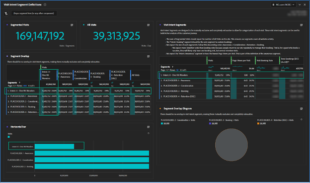

# 고객 여정 세그먼트 작성

이 단계별 가이드를 따라 Adobe Analytics에서 행동 기반 고객 여정 세그먼트를 만들고 Adobe Experience Cloud을 통해 고객의 경험을 향상시키는 방법을 알아봅니다.

더 나은 고객 여정 세그먼트를 만들어 보겠습니다! 이 시리즈에서는 Adobe Analytics을 사용하여 행동 기반 세그먼트를 정의하고, 대상 크기를 추정하여 사용자 이동을 추적할 것입니다. 결국 Adobe Experience Cloud을 통해 미디어를 개인화하고 고객의 경험을 향상시킬 수 있습니다. 이러한 세그먼트는 사용 중이며 고객에 대해 자세히 알 때 업데이트해야 합니다. 보고 시 몇 가지 문제가 발생할 수 있지만, 걱정하지 마십시오. 제가 안내해드리겠습니다! 먼저 &quot;하나의 히트 경사&quot; 세그먼트로 시작하는 첫 번째 고객 여정 세그먼트를 만듭니다.

오늘은 첫 번째 고객 여정 세그먼트에 대한 자리 표시자를 만들고, 세그먼트를 정의하는 데 도움이 되는 Adobe Analytics 작업 공간을 만들며, 첫 번째 세그먼트인 &quot;하나의 히트 원더스&quot;를 정의합니다.

이 시리즈가 끝나면 행동 신호를 기반으로 Adobe Analytics에서 고객 여정 세그먼트를 만들 수 있습니다. 여정의 각 단계에서 각 대상자의 크기를 예측하고 해당 단계 간에 사용자가 이동하는 속도를 파악할 수 있습니다. 또한 이러한 고객 여정 대상을 Adobe Experience Cloud으로 내보내 개인화 및 미디어 타깃팅을 활성화할 수 있습니다.

각 비즈니스는 서로 다르며, 이는 고객 여정 세그먼트가 내 세그먼트와 다르게 표시됨을 의미합니다. 따라서 세그먼트에 대한 특정 공식을 처방하지 않고 몇 가지 주목할 만한 사항과 이를 작성하는 전반적인 프로세스를 제안합니다.

또한 고객 여정 세그먼트가 활성 세그먼트임을 유의해야 합니다. 이것은 일회성이 아니다. 고객에 대해 자세히 알아보고 나면 이러한 세그먼트를 업데이트합니다. 이 경우 보고에 몇 가지 문제가 발생합니다. 사람들은 보고서에서 일관성을 원하며, 세그먼트 정의가 변경되면 보고서에 있는 숫자도 변경됩니다.

## 방문 의도 세그먼트 시작

고객 여정 세그먼트를 작성하는 첫 번째 단계는 고객이 행동 신호를 사용하여 웹 사이트에 있는 이유와 가능한 경우 고객 음성 데이터를 추론하는 것입니다. 방문 의도 세그먼트 세트를 작성하여 웹 사이트의 모든 방문을 분류합니다. 이때 방문 의도 세그먼트는 상호 배타적이고 완전히 완성되어야 합니다. 모든 방문은 하나의 방문 의도 세그먼트에 속해야 하며 하나만 방문 의도 세그먼트에 속해야 합니다.

방문 의도 세그먼트는 방문을 설명하므로 세그먼트 정의에서 방문 컨테이너를 사용합니다.

내 초기 방문 의도 세그먼트 세트가 다음과 같이 포함됩니다.

* 한 번의 히트 원더스
* 인지도
* 고려 사항
* 예약(구매)
* 유지(예약/구매 관리)

방문 의도 세그먼트를 쉽게 사용할 수 있도록 하기 위해 &quot;의도:&quot;를 사용하여 세그먼트 이름을 접두사로 추가하고, 정렬을 활성화하기 위한 숫자를 지정하고, &quot;의도&quot;에 태그를 지정합니다. 내 세그먼트는 아래 그림 같았다.

**페이지 보기 수 >= 1의 자리 표시자 정의가 있는 방문 컨테이너를 사용하여 계속해서 방문 의도 세그먼트를 만듭니다.**

보시다시피 이러한 세그먼트를 만드는 것은 반복적이고 상호 연결된 프로세스입니다. 향후 게시물에서 이러한 세그먼트를 작성하는 과정을 설명합니다.

## 방문 의도 세그먼트 데이터 품질 작업 공간

간단한 작업 공간을 사용하여 방문 의도 세그먼트를 잘 정의했습니다. 각 방문은 하나의 방문 의도 세그먼트에 속해야 하며 하나만 방문해야 합니다. 설정한 작업 공간에서는 모든 방문을 계산하며 세그먼트 간에 겹치지 않도록 합니다.

작업 공간 이름을 &quot;데이터 품질: &quot;데이터 품질&quot;, &quot;방문 의도&quot; 및 &quot;고객 여정&quot; 태그가 있는 방문 의도 세그먼트&quot;를 참조하십시오. 나중에 &quot;방문 의도 대시보드&quot;를 작성하겠습니다. 따라서 접두사 &quot;DATA QUALITY&quot;는 이 작업 영역이 세그먼트를 설정하고 유지 관리하는 용임을 나타냅니다. 비즈니스 통찰력은 거의 없지만 세그먼트를 유지하는 데 중요한 역할을 하는 관리 대시보드입니다. 세그먼트가 올바르게 정의되어 있는지 확인하기 위해 정기적으로 이 대시보드로 돌아가거나 경고를 설정하는 것이 좋습니다.

이 작업 영역에서 가장 중요한 시각화는 왼쪽 중간에 있는 세그먼트 Overlap 자유 형식 시각화입니다. 방문 횟수 지표를 사용하여 각 방문 의도 세그먼트에 대한 열 필터와 맨 오른쪽 열에 있는 모든 방문 수 세그먼트를 만듭니다. 왼쪽의 각 방문 의도 세그먼트에 대한 행을 만듭니다. 이제 탭 간 시각화가 제공됩니다. 세그먼트가 올바르게 구성되면 한 열과 한 행에 데이터가 있고 각 방문 의도 세그먼트의 교차 지점에 데이터가 있습니다.

다음으로 중요한 시각화는 왼쪽 상단에 있는 요약 지표입니다. 세그먼트화된 방문 횟수 요약은 바로 아래 세그먼트 Overlap 시각화에 있는 모든 방문 횟수 열에서 값을 가져옵니다. 모든 방문 횟수 요약에는 숨겨진 테이블이 있습니다.

오른쪽 상단에서 세그먼트가 형성되는 방식에 대한 일부 &quot;맛&quot;을 제공하기 위해 각 세그먼트에 추가 지표를 추가했습니다. 특히 이러한 세그먼트는 상호 배타적이므로 Booking Intent 세그먼트에 대한 예약만 볼 것으로 예상됩니다(다만, 이러한 Visit Intent 세그먼트를 방문자를 기반으로 할 때 전환율이 계산될 수도 있습니다.).

방금 자리 표시자 세그먼트를 만들었다는 것을 기억하십시오. 따라서 처음에는 작업 영역이 이상하게 보일 것입니다. 모든 방문 의도 세그먼트는 동일한 정의가 있으므로 100%와 겹칩니다. 이것은 정확하며, 이 시점에서 보고 싶은 것이 바로 그 과정입니다. 세그먼트 정의를 작성하면 이러한 세그먼트가 모양을 만들기 시작하는 것을 볼 수 있습니다.

## 첫 번째 방문 의도 세그먼트 작성

방문 의도 세그먼트를 정의하는 것은 제거 프로세스의 일부이며, 이러한 세그먼트 간에 상호 종속성이 많습니다. 그래서 여정 순서대로 이러한 세그먼트를 만들지 않고 가장 쉽게 정의되는 것부터 가장 어려운 것까지 순서대로 구성했습니다. 이 주문을 받았습니다.

1. 의도: 0 - 한 번의 히트 원더스
1. 의도: 3 - 예약
1. 의도: 4 - 유지
1. 의도: 2 - 고려 사항
1. 의도: 1 - 인지도

꽤 무작위죠? 이러한 방문 의도 세그먼트를 정의하는 것은 반복적이고, 프로세스를 수행하며, 종종 다른 세그먼트에 대한 업데이트가 필요한 하나의 세그먼트에 대한 조정이었습니다. 이러한 각 세그먼트를 정의하는 방법을 설명하면 더 명확해집니다.

오늘, 우리는 우리의 첫 번째, 가장 쉬운, 하나의 히트 불가사의를 정의하겠습니다

## 하나의 히트 원더스 세그먼트 작성

첫 번째 세그먼트인 &quot;하나의 히트 원더스&quot;는 정의하기가 쉬웠습니다. 페이지 보기가 하나만 있는 모든 방문입니다. 사용자가 바운스되어 웹 사이트에 있었던 이유를 알 수 없습니다. 해당 시작 페이지를 기준으로 의도를 추측할 수 있지만, 한 페이지 보기만 있는 경우 의도에 대한 올바른 추측을 하기에 충분한 정보가 없습니다.

이 세그먼트를 정의하면 방문 의도 작업 영역의 모양이 표시됩니다.

Adobe Analytics을 사용하여 고객 여정 세그먼트를 만드는 것은 어렵지만 보람 있는 프로세스입니다. 행동 기반 세그먼트를 만들고, 대상 크기를 추정하고, 사용자 움직임을 추적함으로써 기업은 미디어를 개인화하고 고객 경험을 향상시킬 수 있습니다. 각 비즈니스는 고유하며, 세그먼트를 만드는 특정 공식이 없지만, 따라야 할 지침과 프로세스가 있습니다. 기업이 고객에 대해 자세히 알아보고 보고 문제를 제시하는 경우 세그먼트를 업데이트해야 합니다. 방문 의도 세그먼트를 작성하는 프로세스에 따라 비즈니스는 전체 고객 경험을 향상시킬 수 있습니다.

## 작성자

이 문서의 작성자:

**아론 포섬**, Director, Digital Analytics

Adobe Analytics 챔피언

