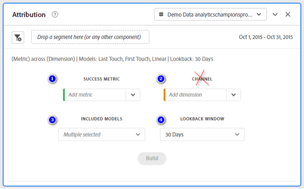
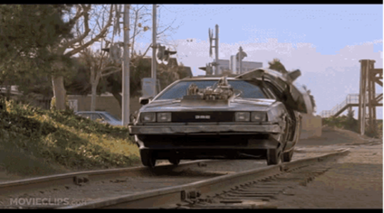

# Adobe Analytics 기여도 분석 패널 및 전환 확인 기간 이해

속성 패널 및 전환 확인 기간을 사용하여 고객 행동을 이해하고 차원 항목이 성공 이벤트에 대한 크레딧을 받는 방법을 사용자 지정하는 방법을 알아봅니다.

## Attribution 패널 사용

&#39;위대한 스콧!&#39;

이 일을 생각해 보자마자 [속성 패널](https://experienceleague.adobe.com/docs/analytics-platform/using/cja-workspace/panels/attribution.html) 및 **전환 확인 기간**&#x200B;허이 루이스의 &#39;백 인 타임&#39;과 &#39;더 뉴스&#39;가 떠올려졌다. 물론, 저는 이런 많은 새로운 도구들에 대한 우리의 일반적인 반응은 그것을 사용하려고 노력하는 것을 연기하는 것이라는 것을 상기했습니다. 왜냐하면 그것들은 너무 복잡해 보이기 때문입니다.

제 말은, 정말로, 단지 그 모든 선택사항들, 스위치, 패널, 재독들, 그리고 매듭들을 보십시오.  그리고 진지하게, 그 자속 커패시터에 대해 이야기합시다.  잠깐, 내가 플럭스 커패시터라고 말했던가?

네, 제가 **속성 패널** 는 매우 복잡한 도구입니다. 그러나 분석가로서 당사의 일반적인 일은 과거에 일어났던 일을 보기 위해 매우 복잡한 도구를 사용하는 것입니다.  이 도구를 라고 합니다 **Adobe Analytics**!

따라서 왜 우리는 우리가 매일 문자 그대로 시간을 뒤돌아볼 수 있게 해주는 그런 멋지고 강력한 도구의 길에 서도록 약간의 두려움과 같은 것을 허용해야 하는가?

우리 모두 그 얘기야, 그렇지?  RIGHT???!! (그러니까, 음, 난 여전히 우리를 괴짜라고 부르는 것은 괜찮고 정치적으로 정확하다고 확신한다.)

아, 누가 신경써?  기어 업, 딕스, 너드, 괴버, 드위브, 테크히스(네 트레키도 마찬가지임), 이제 자동차 스테레오를 들을 수 있습니다.

&quot;그러니 날 데려가, 난 상관없어!  하지만 약속해... 내가 제시간에 돌아올 거라고!&quot;

지금 주의 깊게 보고 있죠?  좋아요!

좀 분해합시다.  이제 우리 모두 흥분하고 **시간 여행**&#x200B;한 걸음 더 물러나 **속성 패널** 실제로

안돼, 안돼, 안돼!  아직 산만하지 말자.  어쩌면, 그것을 다시 시도해보겠습니다.

in **속성**&#x200B;를 사용하면 개인, 여러 개인 또는 시간에 따라 한 개 또는 여러 가지 다른 항목에 의해 이벤트/작업이 수행되는 방식을 고려하면 됩니다.

에 따라 [Adobe](https://experienceleague.adobe.com/docs/analytics-platform/using/cja-dataviews/component-settings/attribution.html), 속성을 사용하면 분석자는 차원 항목이 성공 이벤트에 대한 크레딧을 받는 방법을 사용자 정의할 수 있습니다.  실제로 어떠한 고객 여정도 결코 진정으로 선형적이며 예측 가능성이 낮습니다.  또한 각 고객은 각자의 진도에 따라 나아갈 것입니다. 종종 되돌아가거나, 시간을 끌거나, 그만두거나, 다른 비선형 동작에 관여할 수도 있습니다. 이러한 자연스러운 동작은 고객 여정 전반에서 마케팅 노력이 미치는 영향을 알기 어렵거나 실질적으로 불가능하게 합니다. 또한 여러 채널의 데이터를 함께 통합하려는 노력에 방해가 됩니다.

이 소리가 익숙해 보이나요?  Marty McFly의 여정의 맥락에서 그것을 생각해보세요.

210톤 기관차에 의해 말살이 없어지기 전에 정말로 데로렌에서 쫓겨났을 때, 그가 트윈 파인즈 쇼핑몰 주차장에서 도망쳤을 때로부터, 그는 210톤 기관차에 의해 말살된 적이 있을 때, 그것은 선형과는 거리가 먼 것처럼 보이며, 그것은 아무도 예측할 수 없었던 것입니다.

하지만, 영화 마술을 통해, 우리는 시간을 통해 마티의 길을 따라가고 그의 모든 터치포인트, 노점, 더블 백, 드롭아웃을 이해하게 된다.

## 속성 모델

실제로, 우리는 **속성 패널** 몇 가지 다른 것을 볼 수 있습니다.  예를 들어, **속성 모델** 방법 표시 **전환** 는 배포 **히트** 특정 그룹에 속해 있어야 합니다.

간단히 말해서, 10명이 버튼을 눌러 문으로 들어간다면, 저희 기여도 분석 모델은 그 10명 중 어떤 사람이 그 버튼을 누르는 것에 대한 신용을 줄 것인지 우리에게 말할 것입니다.  이를 염두에 두고 속성 모델이 그러한 10명에게 영향을 주는 몇 가지 예를 살펴보겠습니다.
* **첫 번째 터치**: 이건 정확히 그 소리처럼 들리네요  이 경우, 그것은 그 문을 걸어 통과한 첫번째 사람에게 100퍼센트의 크레딧을 줍니다.  이를 위해 마케터는 Social 또는 Display와 같은 전술에서 이를 사용할 가능성이 높지만, 종종 온사이트 제품 권장 사항 효과를 위한 훌륭한 전술입니다.
* **마지막 터치**: 또한 그것은 정확하게 들리는 것처럼 들립니다.   이 모델은 문을 걸어 들어온 마지막 사람에게 100% 크레딧을 줍니다.  이 모델은 검색 및 단기 마케팅 주기 캠페인과 같은 사항을 분석하는 데 종종 사용됩니다.
* **선형**: 이것은 그 문을 통과한 모든 사람에게 동등한 신용을 준다.  그래, 드로리안을 구해서 데드로리안을 구해서  모두 델로렌!!!
* **U자형**: 이 것은 문에 있는 첫 번째 사람에게 신용의 40퍼센트를 주고, 신용의 20퍼센트를 그 사이에 있는 모든 사람에게 배포한 후 마지막 하나까지 40퍼센트를 줍니다.  프런트 엔드와 백 엔드에서 모두 과반수 전환을 인식하려는 경우뿐만 아니라 그 사이에 기여하는 일부 상호 작용에 약간의 크레딧을 뿌리려는 상황에 대해 생각해 보십시오.
* **시간 감소**: 다른 모델을 검토하기 위해 공식 설명서로 보내기 전에 이 모델을 공유하지 않았더라면 놓칠 수 있었습니다.  브라운 박사님의 풀루토늄처럼, 이 모델은 말 그대로 기하급수적으로 떨어지는 반감기를 가지고 있습니다!  이 경우 이 모델의 반감기에 대한 기본 매개변수는 7일입니다.  이 기능이 작동하는 방식은 초기 터치포인트 이후 경과되는 시간과 고객이 전환되는 시간을 기반으로 각 마케팅 채널에 가중치를 적용하는 것입니다.

이것과 나머지 항목에 대한 추가 정보 **속성 모델**, [여기를 클릭하십시오.](https://experienceleague.adobe.com/docs/analytics/analyze/analysis-workspace/attribution/models.html).

이것을 더 흥미롭게 하기 위해, 그것에 대해 이야기합시다 **전환 확인 기간**.

네, 여기 있습니다. 시간을 되돌아가세요!!  여기가 재미가 시작되는 곳이니까!

Adobe 정의 **전환 확인 기간** 터치 포인트를 포함하도록 전환에서 다시 확인해야 하는 시간의 양입니다. 첫 번째 상호 작용에 더 많은 크레딧을 제공하는 속성 모델은 서로 다른 전환 확인 기간을 볼 때 더 큰 차이를 보입니다.&quot;

* **방문 전환 확인 기간**: 전환이 발생했을 때 방문 시작 부분까지 되돌아봅니다.
* **방문자 전환 확인 기간**: 현재 날짜 범위 달의 1일까지의 모든 방문을 다시 봅니다.
* **사용자 지정 전환 확인 기간**: 보고 날짜 범위 넘어 속성 기간을 최대 까지 확장할 수 있습니다 **90일**.

만약 당신이 &quot;All the Back to the Future&quot; 영화를 보았다면, 당신은 Marty McFly가 한 번 이상 제 시간에 돌아갔다는 것을 알고 있으며, 당신은 또한 그가 1955년으로 한 번 이상 돌아갔다는 것을 압니다.  전환 이벤트로 &quot;Gray&#39;s Sports Almanac&quot;를 획득할 때 힌지 역할을 한다면 다음 사항을 고려하십시오.

1. 조금 전에 **오전 1:30분** on **1985년 10월 26일** Marty McFly가 제 시간에 **1955년 11월 5일**&#x200B;시간여행을 하는 드로리안에서 소나무를 처음으로 뛰어넘고  다음 주 반 동안, 그는 그의 부모님을 포함한 여러 사람들과 상호 작용하며, 결국 그의 아버지가 Biff라는 이름의 괴롭히는 사람에 맞서기 위해 영향을 주어 미래에 영향을 준다, 그래서 그의 아빠는 성공적인 과학-소설 작가가 될 자신의 잠재력을 실현할 수 있다.
1. 같은 날 아침 늦게 **1985년 10월 26일**&#x200B;그리고 에메트 브라운 의사가 마티 맥플라이의 진입로에 도착해서 그와 그의 여자친구에게 그들의 아이들에게 어떤 것이 끔찍하게 잘못되었다는 것을 알리고 그들은 그들의 문제를 해결하기 위해 미래로 달려가야 한다고 알려준다.  그들이 떠나면서, 그들의 출발은 Biff에 의해 목격되는데, 그들은 날아다니는 데로란을 보는 것이 이상하다는 것을 발견합니다.  나중에, 비프가 다시 하늘을 나는 드로렌안을 목격하고 심지어 나중에 마티의 &quot;두 버전&quot;을 보는 것을 포착할 때, 그는 물건들을 조립하기 시작했다.   &quot;타임머신&quot;이 개인적인 이득과 연구에만 어떻게 사용되어야 하는지&quot; 라는 브라운 박사와 마티의 주장을 그가 무시했을 때(마티가 스포츠 마락을 과거로 가져가는 것을 고려하는 이유는), 비프는 시간을 훔치는 반면, 두 사람은 과거에 그의 젊은 자신에게 스포츠 마락을 전달하는데 정신이 산만했다.
1. 그들의 미래 여행 후, 브라운 박사와 마티가 **1985년 10월 26일** 그들은 인식하지 못하고, 그들은 타임라인이 사악한 비프에 의해 바뀌었다고 추론합니다.  그들이 무슨 일이 있었는지 알아야만 한다는 것을 깨달으면서, Doc와 Marty는 다시 돌아가기로 결심했다 **1955년 11월 12일**&#x200B;마티가 처음 방문했을 때 모든 것이 변했던 운명적인 밤 **1955년**.  Doc와 Marty는 결국 미래의 Old Biff가 Young Bibff에게 전달했던 스포츠 경기를 훔쳐서 하루를 살렸다 **1955년**&#x200B;그러나 진정한 즐거움과 이해를 위해 3부작 영화를 꼭 봐야 할 필요는 있다.

Adobe의 **속성 모델** 및 **전환 확인 기간**, 몇 가지 흥미로운 시나리오로 끝날 수 있습니다.

* 사용 **첫 번째 터치** 그리고 **방문 전환 확인 기간**&#x200B;이에 대한 기여는 마티의 최근 &quot;전환&quot;이 발생한 것을 봅니다. 그와 Doc가 젊은 비프에서 스포츠 의류를 훔치고 퇴비에 대한 그의 혐오감을 유지하려고 노력했을 때입니다.

* 믿거나 말거나 **첫 번째 터치** 그리고 **방문자 전환 확인 기간**, 속성은 Biff가 최종적으로 승리하는 전환을 선호합니다.
* 적용 **선형 전환 창** 모든 타임라인이 존재하는 다중 시가 됩니다.  죄송합니다. **마블** 또는 **스타트렉**!

그리고 이 시점에서, 저는 여러분이 그 아이디어를 얻기 시작하기를 바랍니다.

그래서, 분석가로서 우리에게 이 모든 것이 무엇을 의미합니까?

다음 **속성 패널** 및 **전환 확인 기간** 은 단순한 표면 수준의 데이터를 넘어 고객 여정을 더욱 깊이 있게 파악할 수 있는 기능을 제공합니다. 전환에 가장 큰 영향을 미치는 접점을 파악하여 마케팅 전략에 대한 현명한 결정을 내리고 리소스를 보다 효과적으로 할당할 수 있습니다.

기억하십시오. **속성 모델** 및 **전환 확인 기간** 선택한 경우에도 세그먼트를 사용하거나 다른 구성 요소로 필터링하여 데이터를 추가로 조작할 수 있습니다.  또한 [패널]을 렌더링하면 기존의 **작업 공간**&#x200B;그건 당신이 공식적으로 시속 88마일로 운전하도록 허가받았음을 의미해요

## 마지막으로 연습하다

개념을 살펴보았으므로, 마케팅 캠페인을 수행하고 전환율을 높이는 데 가장 효과적인 채널을 파악하려고 한다고 생각해 보십시오. 다음을 통해 **속성 패널**&#x200B;를 볼 수 있을 뿐만 아니라 **마지막 터치**, **첫 번째 터치**, **동일한 터치**, 그리고 전환을 유도하는 데 가장 효과적인 채널을 결정하기 위해 선택하는 다른 모든 모델. 그런 다음 이 정보를 사용하여 캠페인을 최적화하고 전반적인 성능을 향상시킬 수 있습니다.

이제 여러분이 할 수 있는 것을 보았으니, 겉보기에 복잡해 보이는 기능들에 겁먹지 마세요 **속성 패널**.  **얼굴** 그래  **포옹** 그래  **이해** 그래  무엇보다도, 그것을 여러분의 장점에 이용하세요. 다음 **속성 패널** 및 **전환 확인 기간** 는 고객과 브랜드를 통해 여정을 심층적으로 파악할 수 있는 열쇠입니다.

이제, 우리는 자신감을 가지고 &quot;과거로&quot; 여행을 할 수 있고, 우리의 신뢰할 수 있는 타임머신의 힘을 사용할 수 있다(즉,  **Adobe Analytics**)을 클릭하여 데이터 기반의 의사 결정을 내릴 수 있습니다. 그리고 가장 중요한 것은, &quot;우리가 가는 곳에, 우리는 길이 필요하지 않습니다!&quot; (자속 커패시터이고, 속성을 잘 아는 사람!)

## 작성자

이 문서의 작성자:

**제프 블루머**, 관리자, Kroger Personal Finance에서 Digital Analytics

Adobe Analytics 챔피언
