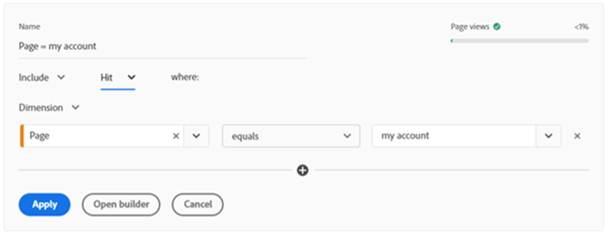

# Analysis Workspace의 세그먼트 빌더와 빠른 세그먼트 간의 차이점

세그먼트는 데이터 분석 툴킷에서 가장 강력한 도구 중 하나일 수 있습니다. 효율성을 위해 Analysis Workspace에서 세그먼트 빌더를 사용하는 것과 빠른 세그먼트 간의 차이점을 알아봅니다.

>[!TIP]
>
> Analysis Workspace에서 각 도구를 사용할 시점에 유용한 미리 알림을 다운로드하려면 페이지 하단에 있는 이미지를 클릭합니다.

세그먼트는 데이터 분석 툴킷에서 가장 강력한 도구 중 하나일 수 있습니다. 특정 트래픽 그룹, 사이트 섹션 또는 고객 여정 그룹을 확인하려는 경우 세그먼트를 사용하는 것은 사이트에 대한 특정 트래픽 하위 세트에 대한 분석에 집중할 수 있는 좋은 방법이 될 수 있습니다. 소매 환경에서 얻은 가장 유용한 세그먼트 중 일부는 신규 고객과 기존 고객, 계정에 로그인한 고객 및 게스트 등 다양한 유형의 고객 그룹을 위한 것입니다. 하지만 사이트 섹션, 특정 작업을 수행하는 고객 또는 생각할 수 있는 그 밖의 모든 것을 대상으로 지정할 수도 있습니다.

**세그먼트를 만드는 방법에는 두 가지가 있습니다.**

* 구성 요소 메뉴에서 세그먼트 빌더 사용
* 패널 위쪽에 있는 빠른 세그먼트 사용

세그먼트 빌더를 사용하여 세그먼트를 작성하는 경우 다른 프로젝트에서 다시 사용하기 위해 세그먼트를 저장할 수 있습니다. 이렇게 하면 사이트의 특정 섹션을 방문한 다음 구입하는 사람 등 특정 고객 그룹에 집중할 수 있습니다. 반면 탐색 분석을 수행하고 서로 다른 세그먼트 설정을 테스트하려는 경우 빠른 세그먼트 빌더가 큰 도움이 될 수 있습니다. 각 방법의 몇 가지 주요 이점을 살펴보겠습니다.

## 빠른 세그먼트

각 패널의 맨 위에서 빠른 세그먼트 아이콘(+ 기호가 있는 단계)을 클릭하여 빌더를 열 수 있습니다. 이렇게 하면 최대 3개의 조건으로 임의의 수준(히트, 방문 또는 방문자)에서 세그먼트를 작성할 수 있습니다. 기본 세그먼트 빌더와 마찬가지로, 세그먼트 빌더에 표시된 전체 세그먼트 볼륨 보기보다 더 간단한 버전이지만 세그먼트가 데이터를 반환하고 있고 세그먼트에 포함된 전체 트래픽 모집단의 비율(%)을 반환하는지 여부를 표시하는 오른쪽의 표시를 제공합니다. 두 개 이상의 조건을 추가할 때 &#39;and&#39; 및 &#39;or&#39; 연산자를 사용할 수 있습니다. 안타깝게도 빠른 세그먼트에 대한 &#39;then&#39; 옵션은 없으므로 순차적 세그먼트가 필요한 경우 전체 세그먼트 빌더를 사용해야 합니다. 빠른 세그먼트에는 컨테이너 한 개로 제한도 있습니다. 빠르게 만들고 편집할 수 있는 기본 세그먼트에 사용됩니다. 빠른 세그먼트가 패널에 적용되거나 저장되면 더 이상 패널 내에서 편집할 수 없습니다.

예비 분석을 수행할 때 서로 다른 유형의 세그먼트를 테스트하여 서로 다른 고객 그룹이 어떻게 반응하는지 또는 서로 다른 카테고리가 어떻게 수행되는지 확인하려고 합니다. 빠른 세그먼트를 사용하는 것은 세그먼트 빌더를 사용하는 것보다 훨씬 더 빠릅니다. 또한 이러한 세그먼트는 생성된 프로젝트에서만 사용할 수 있으므로 원하는 결과를 제공하지 않는 경우, 마스터 목록에서 저장된 세그먼트를 삭제하는 것에 대해 걱정할 필요가 없습니다. 세그먼트를 테스트한 후 다른 프로젝트에서 유용하다는 것을 알게 되면 항상 &#39;빌더 열기&#39; 단추를 클릭하여 전체 세그먼트 빌더에서 세그먼트를 열어 일반 세그먼트로 저장할 수 있습니다. 그러나 이러한 작업을 수행하면 빠른 세그먼트 빌더에서 더 이상 편집할 수 없습니다.

## 세그먼트 빌더

왼쪽 구성 요소 메뉴에서 세그먼트 목록 위에 있는 + 기호를 클릭하거나 구성 요소 드롭다운을 클릭하고 &#39;세그먼트 만들기..&#39;를 선택하면 세그먼트 빌더에 액세스할 수 있습니다. 빠른 세그먼트와 달리, 이 세그먼트에는 모든 옵션이 있습니다. 여러 조건을 추가하기 위해 &#39;then&#39; 연산자를 사용하여 순차적 세그먼트를 만들 수 있습니다. 순차적 세그먼트는 또한 &#39;논리 그룹&#39;을 히트, 방문 또는 방문자가 아닌 수준으로 사용할 수도 있도록 해줍니다. 세그먼트 빌더를 사용하면 세그먼트에 설명을 추가할 수도 있습니다. 이 설명을 통해 세그먼트를 작성한 사용자 또는 세그먼트를 필터링하기 위해 빌드한 데이터 유형에 대한 컨텍스트를 추가할 수도 있고, 빠른 세그먼트 빌더 내에서 가능하지 않은 조직 목적을 위해 세그먼트에 &#39;태그&#39;를 추가할 수도 있습니다.

세그먼트를 사용해야 하거나, 컨테이너를 사용해야 하는 경우, 세그먼트에 3개 이상의 조건이 있을 경우 세그먼트 빌더를 사용하는 것이 중요합니다. 전체 세그먼트 빌더에는 더 복잡한 세그먼트를 만드는 선택 사항이 더 많이 있어서, 다양한 고객 유형, 카테고리, 고객 여정 등을 분류할 수 있습니다. 이러한 세그먼트를 만들고 저장하면 세그먼트 마스터 목록에 추가됩니다. 즉, Experience Cloud에 태깅하거나, 승인하고, 공유하고, 여러 보고서에서 사용하고, 세그먼트에 게시할 수 있습니다. Experience Cloud에 게시하면 개인화 타깃팅을 위해 Adobe Target과 같은 다른 Adobe 제품의 세그먼트를 활용할 수 있습니다. 세그먼트 빌더에 포함된 세그먼트는 빠른 세그먼트 패널에서 편집할 수 없으므로 세그먼트 빌더를 열어 변경해야 합니다. 다행히 오른쪽의 미리 보기 시각화는 세그먼트가 지난 90일 동안 가져올 트래픽에 대한 보다 자세한 분석을 제공합니다. 즉, 저장하기 전에 사용자가 원하는 항목으로 세그먼트가 가져올 수 있음을 의미합니다.

## 사용 사례

업종별로 사용자 지정 세그먼트를 작성하는 데 사용하는 방식이 다를 수 있습니다. 대규모 소매점의 전자 상거래 부서에서 근무하는 Dell은 고객의 구매 경로를 파악하기 위해 탐사 분석을 수행하는 경우가 많습니다. 장바구니에 제품 추가 또는 주문 배치와 같은 작업에서 스파이크나 드롭이 표시되면 빠른 세그먼트를 사용할 수 있는 것입니다. 분석 중에 특정 유형의 고객 또는 고객이 클릭하는 특정 작업/링크에 대한 세그먼트를 빠르게 만들 수 있습니다. 세그먼트 빌더를 열고 각 세그먼트를 저장하지 않아도 되므로 조건을 빠르게 추가한 다음 빠르게 제거할 수 있습니다. 이렇게 하면 사이트에서 변경 사항이 표시되는 이유를 설명하려고 할 때 많은 시간이 절약됩니다.

또는 세그먼트 빌더가 자주 사용되는 경우가 있습니다. 모든 고객이 동일하지는 않으며, 고객이 선택하는 작업 또는 경로로 식별되는 특정 유형의 고객을 선호합니다. 세그먼트 빌더를 사용하여 여러 조건을 추가하여 다른 유형의 고객을 식별하고 세그먼트를 저장하여 여러 분석가가 공유하고 사용할 수 있습니다. 보고서에서 이러한 유형의 세그먼트를 일관되게 유지하는 것이 중요하므로, 결과가 다를 수 있으므로 모든 사람이 사용할 수 있도록 구축된 세그먼트가 각 사용자가 고유한 버전을 만드는 것보다 낫습니다.

전반적으로 빠른 세그먼트와 세그먼트 빌더 모두 분석에 사용할 수 있는 훌륭한 도구입니다. 그들은 각각 목적, 이점, 단점이 있습니다. 빠른 참조 안내서를 보려면 아래의 유용한 다운로드 가능한 팁과 트릭 시트를 확인하십시오.

## 작성자

이 문서의 작성자:

**맨디 조지**, Digital Analyst III 앳 베스트 바이 캐나다

Adobe Analytics 챔피언

## 다운로드

