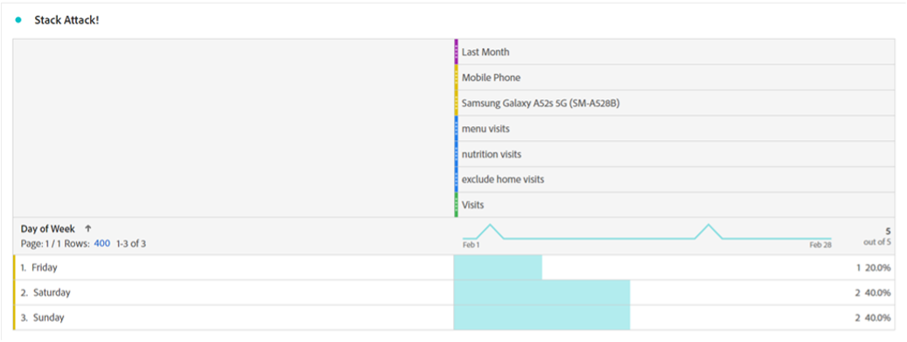
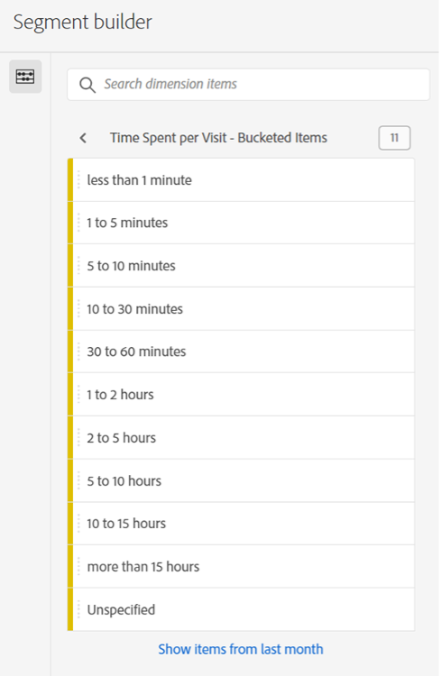

# 세그먼트를 사용하여 Analysis Workspace에서 새로운 인사이트를 발견하기만 하면 됩니다

신규 Adobe Analytics 사용자든 숙련된 프로든 간에 Analysis Workspace 프로젝트에서 세그먼트를 상당히 활용하게 됩니다. 로서의 [Adobe Experience League](https://experienceleague.adobe.com/docs/analytics/components/segmentation/seg-overview.html?lang=en) 에서는 &quot;세그먼트를 사용하여 특성 또는 웹 사이트 상호 작용에 따라 방문자 하위 세트를 식별할 수 있습니다&quot;라고 설명합니다. 이 기능의 기본 결과는 사용자, 방문 또는 히트 그룹을 사이트에 격리하는 것을 의미하지만, 여러분 자신과 같은 날카로운 분석가는 이 도구를 사용하여 창의력을 얻고 사이트 활동에 대한 통찰력을 얻을 수 있는 새로운 방법을 찾을 수 있습니다. 가능한 옵션 목록은 매우 다양하므로 언제든지 원하는 항목을 만들어 조직 또는 온라인 커뮤니티에서 다른 사용자와 공유할 수 있습니다 [Adobe Analytics 커뮤니티](https://experienceleaguecommunities.adobe.com/t5/adobe-analytics/ct-p/adobe-analytics-community) Experience League 또는 [#Measure Slack](https://www.measure.chat/) 커뮤니티에 가입하면 됩니다.

세그먼트를 만드는 방법에 대한 빠른 리프레셔가 필요한 경우 [세그먼트 빌더](https://experienceleague.adobe.com/docs/analytics/components/segmentation/segmentation-workflow/seg-build.html?lang=en) Analysis Workspace.

## 대비 세그먼트 비교

Analysis Workspace에서 &quot;[세그먼트 비교](https://experienceleague.adobe.com/docs/analytics/analyze/analysis-workspace/panels/segment-comparison/segment-comparison.html?lang=ko)&quot;. 세그먼트 비교는 왼쪽 탐색 막대의 패널 섹션에서 찾을 수 있습니다.

그러나 최종 사용자에게 홈 키 통찰력을 제공하기 위해 전체 비교 패널이 필요하지 않은 경우가 있습니다. 감사하게도 일부 기능은 표준 패널에서도 비교할 수 있습니다.

다음 [벤 다이어그램 시각화](https://experienceleague.adobe.com/docs/analytics/analyze/analysis-workspace/visualizations/venn.html?lang=ko) 는 빠르게 비교할 수 있도록 마우스를 가져가면 중복된 세션, 주문, 사용자 등을 볼 수 있습니다. 2-3 사용자 지정 세그먼트 간. 겹치는 섹션 중 하나를 마우스 오른쪽 단추로 클릭하여 세그먼트를 빠르게 작성할 수도 있습니다.

중요한 정보가 겹치는 데이터에는 없지만 겹치지 않는 데이터는 경우가 있습니다. 한 세그먼트의 사본을 만들어 &quot;제외&quot; 세그먼트로 만드는 것이 이를 보는 빠른 방법입니다.

비교 시 &quot;제외&quot; 세그먼트를 다른 세그먼트와 스택함으로써 이제 동일한 세션에서 홈 페이지를 보지 않고 메뉴 페이지에 방문한 방문 수를 빠르게 계산할 수 있습니다.

## 스택 공격

마찬가지로 세그먼트를 함께 스택하여 벤 다이어그램의 교차 데이터를 만들 수 있습니다. 스택하는 세그먼트 또는 개별 차원의 수에 제한이 없습니다. 예를 들어, 지난 달 며칠의 내 사이트에서 휴대 전화, 특히 삼성 갤럭시 A52에 대해, 내 메뉴와 영양 페이지를 보았으나, 내 홈 페이지를 보지 못한 것을 빨리 알고 싶다면, 이렇게 바로 만들 수 있습니다.

하지만 더 나은 것은 사용자 또는 방문 기준에서 완벽한 하위 집합을 찾으면 모든 값을 선택하고 마우스 오른쪽 단추로 클릭한 다음 세그먼트를 즉시 만들 수 있다는 것입니다.

그것은 한 부분에서 많은 힘입니다.

## 세그먼트 수에 대한 숫자 세그먼트

많은 사용자가 세그먼트를 작성할 때 명목, 서수 또는 간격 값(페이지 방문, 사용자 연령 범위 또는 사용자가 과거에 수행한 방문 횟수)을 살펴봅니다. 그러나 비율 데이터는 물론, 조직의 표준 차원, 표준 지표 또는 사용자 지정 변수 및 지표이든 이러한 값을 그룹화하여 세그먼트를 만들 때도 사용할 수 있습니다.

예를 들어, 페이지에서 보낸 시간 또는 방문당 체류 시간 에는 미리 만들어진 버킷이 사용 가능합니다.

그러나 이러한 방문자가 조직의 요구 사항에 항상 맞는 것은 아닐 수 있습니다. 사이트 방문 횟수가 10분 미만일 수 있습니다. 세부 측정을 사용하여 크기가 다른 버킷을 만들 수 있습니다. 다음은 1분, 1초 및 1분, 30초 사이의 마지막 방문을 보기 위해 만들어진 방문입니다.

생성되면 이제 사용자 지정한 다른 그룹 그룹별로 방문, 주문 및 기타 이벤트를 볼 수 있습니다.

기본적으로 KPI(주요 성과 지표)가 어떻게 변경되는지에 대해 사용자가 얼마나 많은 시간을 소비하는지, 방문에서 페이지 수가 측정되거나, 과거에 방문한 적이 있는 횟수 또는 다른 숫자 값으로서 검사할 수 있도록 함으로써 다른 지표의 일부로 지표를 볼 수 있습니다.

세그먼트를 사용하여 새로운 통찰력을 찾을 가능성은 무한합니다! 이것은 단순히 시작점입니다. 직접 몇 가지 시도를 하여 커뮤니티에 표시되는 내용을 알려 보십시오. [Adobe Analytics 커뮤니티](https://experienceleaguecommunities.adobe.com/t5/adobe-analytics/ct-p/adobe-analytics-community) Experience League 또는 [#Measure Slack](https://www.measure.chat/) 커뮤니티에 가입하면 됩니다.

세그먼트화!

## 작성자

이 문서의 작성자:

**댄 커밍스**, McDonald&#39;s Corporation의 제품 엔지니어링 분석 관리자

Adobe Analytics 챔피언

