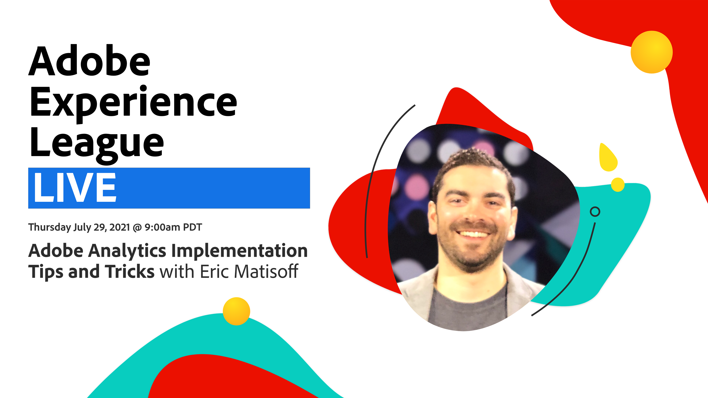

# Experience League 라이브

Experience League LIVE는 Experience League 팀이 만든 라이브 스트리밍 쇼이며, Experience Cloud 애플리케이션, 애플리케이션 서비스 및 Adobe Experience Platform에서 적용할 수 있는 유용한 팁, 요령 및 전략을 제공합니다.

>[!TIP]
>
>추가 학습 방법은 무료 [교육 과정](https://experienceleague.adobe.com/#dashboard/learning)과 개별 [자습서](https://experienceleague.adobe.com/docs/home-tutorials.html)를 확인하십시오.

## 예정된 에피소드

Experience League LIVE의 다음 예정된 에피소드에 일정 표시!

<table>
<tr>
  <td>
    <strong>날짜</strong>
  </td>
  <td>
    <strong>게스트</strong>
  </td>
  <td>
    <strong>주제</strong>
  </td>
</tr>
<tr>
  <td>
    2021년 8월 26일 목요일
  </td>
  <td>
    David Kao, 제품 관리자
  </td>
  <td>
    실시간 CDP 대상의 새로운 기능 활용
  </td>
</tr>
</table>

## 과거 에피소드 재생

Experience League LIVE 에피소드를 놓치셨나요? 감히! JK. 우리는 당신을 용서합니다. 여기 지난 에피소드를 볼 수 있는 링크들이 있습니다.

<table>
<tr>
  <td>
    <strong>재생 날짜</strong>
  </td>
  <td>
    <strong>게스트</strong>
  </td>
  <td>
    <strong>재생 정보/링크</strong>
  </td>
</tr>
<tr>
  <td>
    2021년 7월 29일
  </td>
  <td>
    에릭 마티소프트, 대시보드 피츠패트릭
  </td>
  <td>
    

</td>
</tr>
</table>