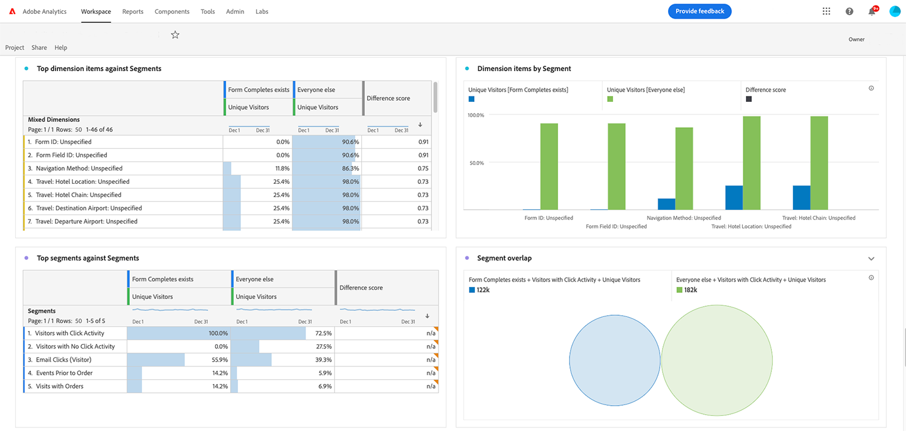

# Analytics란 무엇입니까?{#what-is-analytics}

Adobe Analytics을 학습하기 위해 컨텐츠에 몰두하기 전에 이 기본 질문인 &quot;Analytics란 무엇입니까?&quot;에 대한 답변을 이해하는 것이 도움이 됩니다. Analytics는 비즈니스 개발 및 혁신을 추진하는 여러 분야를 포괄하는 광범위한 용어입니다. 즉, 비즈니스 및 데이터 분석을 지원합니다. 그 둘 사이에는 차이가 있다. 자세히 봅시다.

## 비즈니스 분석의 역할

최근 몇 년 동안, 상용 목적으로 인터넷을 사용하는 것의 탄생과 성숙은 폭발하였고, 그래서 소비자들이 그들의 브랜드에 어떻게 상호 작용하고 참여하는지에 대해 조직들이 수집한 데이터의 양이 많아졌다. 이전에 빅데이터라는 용어를 들어본 적이 있다면, 이것은 비즈니스 분석의 영역에 해당됩니다.

비즈니스 분석은 비즈니스 인텔리전스의 구성 요소이며 큰 그림의 전략적 위험과 기회에 중점을 둡니다. 그것은 회사들이 그들의 산업에서 경쟁력을 유지하기 위해 반드시 보유해야만 하는 필수 능력입니다.

비즈니스 분석에는 네 가지 유형이 있습니다.

* **설명**: 여기에는 이전 데이터를 사용하여 조직의 비즈니스 트렌드를 파악해야 합니다. 예를 들어 소매업체는 피크 또는 휴일 시즌 전에 제품 수요를 예측해야 하며 비즈니스 목표를 달성하기 위해 최적의 인벤토리가 필요합니다.
* **진단**: 예상치 못한 결과의 원인은 무엇입니까? 성수기 동안 제품이나 서비스에 대한 극적인 수요가 있었던 이유는? 진단 분석은 보다 심층적인 수사적 분석이며 데이터로부터 상관 관계를 도출하는 것을 목표로 합니다.
* **Predictive**: 여기서는 이전 데이터를 사용하여 가능한 결과 또는 이벤트를 결정합니다. 머신 러닝(ML) 및 AI(인공 지능)은 일반적으로 보다 정확한 예측을 위해 사용됩니다. 고객 이탈은 예측 분석의 실제 활용 사례를 보여줍니다. 이 분석에서는 상관 관계를 찾아 이탈할 가능성이 있는 고객의 특성을 식별하여 이를 방지하기 위해 작업을 수행할 수 있습니다.
* **규범**: 원하는 결과에 대한 최상의 경로를 파악하는 것을 목표로 하는 고급 형태의 예측 분석입니다. 이러한 유형의 분석에서는 ML 및 AI 기술도 사용합니다. 소매업체는 규범적 분석을 사용하여 영업을 변경하여 마진을 개선합니다.

## 데이터 분석의 역할

Data Analytics는 비즈니스 분석에서 사용되는 것과 동일한 많은 기술을 사용하지만, 범위가 넓고 사실상 더 기술적입니다. 예를 들어 빅데이터 분석은 데이터의 품질과 조직에 의존합니다. 데이터는 얼마나 효과적으로 정렬, 저장 및 정리됩니까? 데이터 과학자들은 데이터 분석 분야에서 일한다. 비즈니스 분석가가 정보를 조직에 전달하여 프로세스와 지표를 최적화하는 데 사용하는 대규모 데이터 세트를 혁신합니다. 데이터 과학자들은 데이터를 더 깊이 깊이 연구하여 트렌드와 연결을 파악합니다.

## Adobe Analytics은 어디에 적합합니까?

Adobe Analytics은 고객 여정을 지원하는 다중 채널 디지털 경험에서 데이터를 수집하고 데이터 분석을 위한 도구를 제공하는 강력한 데이터 분석 플랫폼입니다. Adobe Campaign은 비즈니스 분석 목적으로 마케터와 비즈니스 분석가가 일반적으로 사용하는 플랫폼입니다.

비즈니스 요구 사항, 데이터 디자인 및 데이터 수집은 효과적인 분석 방법의 주요 요소입니다. 처음에, 고객은 웹 및 모바일과 같은 기존 디지털 경험에 대한 주요 고객 여정 및 원하는 비즈니스 결과에 대한 데이터를 수집하는 것으로 시작합니다. 데이터는 다음과 같은 질문에 답변해야 합니다.

* &quot;방문자에게 인기 있는 컨텐츠 및 컨텐츠 유형은 무엇입니까?&quot;
* &quot;매출, 예약, 리드 또는 구독과 같이 고부가가치 전환이 발생하는 경로는 무엇입니까?&quot;
* &quot;알려진 방문자와 알 수 없는 방문자에게 어떤 제품, 서비스 또는 콘텐츠를 표시해야 합니까?&quot;
* &quot;디지털 마케팅 채널은 어떻게 수행됩니까?&quot;

Data Foundation이 Adobe Analytics에 수집되면 마케터와 비즈니스 분석가는 제품에서 사용할 수 있는 다양한 보고서 및 데이터 시각화 도구를 사용하여 분석을 수행하고 데이터에 대한 의미 있는 스토리를 전달합니다. 또한 Adobe Analytics에서는 다양한 형태의 출력을 제공합니다. A/B 테스트를 실행하기 위해 Adobe Target과 같은 최적화 도구로 전송되는 세그먼트 또는 대상일 수 있습니다. 모델링을 위해 다른 시스템에서 사용하는 사람에 의한 작업 가능성을 나타내는 예측 점수가 될 수 있습니다.

시간이 지나면서 고객은 CRM, 콜 센터, 브릭 및 모르타르, 음성 도우미 등을 비롯한 다른 채널 소스를 통해 기존의 웹 및 모바일 데이터를 보강합니다. Adobe Analytics은 거의 모든 채널 소스에서 데이터를 캡처하여 강력한 분석 데이터 기반을 구축하는 다양한 방법을 제공합니다.

추가 데이터 세트를 수집하면 마케팅 기여도 분석 및 예외 항목 탐지 등의 고급 데이터 모델이나 기계 학습을 사용하는 보다 고급 유형의 규범적 데이터 분석을 수행하는 문이 열립니다.

Adobe Analytics의 주요 이점 및 기능을 안내하는 Experience League 관련 자습서에 참여할 것을 권장합니다.
