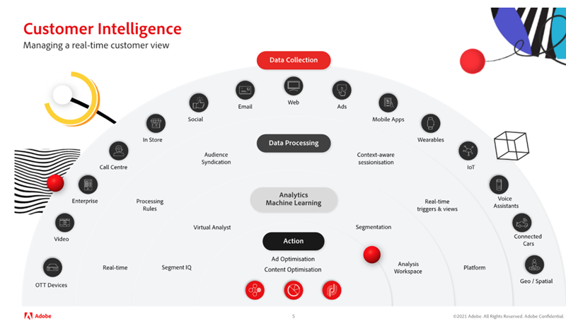

# Adobe Analytics의 Virtual Analytics 및 Segment IQ를 통해 고객 인텔리전스 마스터하기

이 문서에서는 인공 지능과 머신 러닝(AI/ML) 사용의 중요성에 대해 알아봅니다. 그런 다음 Virtual Analyst 및 Segment IQ를 사용하여 글로벌 고객의 이점과 실제 성공 사례를 검토하여 예외 항목을 감지하고 이상치를 방지하며 ROI를 극대화합니다.

## 인공 지능의 가치

체스 챔피언 Garry Kasparov가 IBM®의 [!DNL Deep Blue]에 패했던 때를 기억할 것입니다. 전문가들은 체스처럼 복잡한 게임에서 기계가 인간의 의사 결정과 판단을 이길 수 없다고 확신했습니다. 그러나 이미 실현됐고 이는 인공 지능의 힘이 발굴됨에 따라 비즈니스 전략과 기술 혁신의 근본적인 변화의 핵심이 됐습니다.

Adobe Analytics는 기업의 모든 사람이 모든 접점에서 대규모로 그리고 실시간으로 자사 브랜드와의 고객 상호 작용을 이해하고 최적화할 수 있도록 하는 경험 비즈니스를 위한 핵심 인텔리전스 시스템입니다.

Adobe AI 도구는 고객을 대체하기 위한 것이 아니라 고객이 노력한 만큼 최대한의 ROI를 달성할 수 있도록 하는 것입니다.

## 분석 변환

분석을 발전시키려면 다음 세 가지 주요 고려 사항에 중점을 두어야 합니다.

1. 조직 - 고객에 대한 전체적인 관점을 만들고, 통찰력 중심의 의사 결정을 우선시하며, 데이터를 민주화하는 방법.

1. 기술 - 데이터 및 기술이 규모에 맞게 개인화를 제공하도록 하는 방법.

1. 고객 - 신뢰를 구축하고 변화에 적응하는 방법.

분석은 복잡하고 시간이 많이 소요되는 작업이지만 인사이트를 얻는 데 필요한 시간을 단축해야 하는 필요성이 지속적으로 존재합니다. 조직이 직면한 주요 문제는 다음과 같습니다.

* 제한된 조직 리소스 - 다양한 비즈니스 목표에 따라 리소스 가용성이 제한될 수 있음
* 제한된 기술 전문 지식 - 지식을 공유하고 데이터를 민주화할 수 있음
* 고객 기대치 - 팀이 고객 행동의 변화에 동적으로 대응할 수 있습니까?

## Adobe Sensei에서 제공하는 Virtual Assistant를 통해 고객 인텔리전스 마스터

### 3단계 고객 인텔리전스

성공적인 고객 인텔리전스 전략과 관해서는 (a) 데이터 수집에서 (b) 데이터 처리, (c) 분석 및 머신 러닝에 이르기까지 세 가지 수준(위의 그림 1 참조)을 거쳐야만 콘텐츠와 광고를 실행하고 최적화할 수 있습니다.

1. 데이터 수집은 조직에 따라 다르며 다양한 채널과 매체를 포함할 수 있습니다. 여기에는 OTT 디바이스, 비디오, 기업, 콜 센터, 매장, 소셜 이메일, 웹, 광고, 모바일 앱, 웨어러블, IoT, 음성 지원, 연결된 카드 및 지리/공간이 포함됩니다.

1. 데이터 처리에는 실시간 데이터 수집, 처리 규칙, 대상 신디케이션, 컨텍스트 인식 세션화, 실시간 트리거 및 보기, 플랫폼이 포함됩니다.

1. 분석 및 머신 러닝에는 세그먼트 IQ, 가상 분석가, 세그먼테이션, Analysis Workspace가 포함됩니다.

### 가상 분석가 활용

[가상 분석가](https://experienceleague.adobe.com/docs/analytics/analyze/analysis-workspace/virtual-analyst/overview.html?lang=ko)를 록스타 분석가로 생각해 보십시오.

* 사무실을 떠날 필요가 없습니다.
* 누가, 무엇을, 언제, 어디서, 왜 하는지 그래서 그 결과는 무엇인지를 알려 줍니다.
* 모든 데이터에 대한 연중무휴 이상 징후 모니터링을 통해 지능형 경고에 즉시 대응
* [!UICONTROL Analysis Workspace]의 구성 요소를 다시 마스터할 수 있습니다.

### 숨겨진 기회 발견

* 마케팅 KPI 현황에 대한 최신 가시성 확보
* 안정적이고 예측 가능한 마케팅 투자
* 고객의 기대에 부응 및 충족/초과

### 실제 성공 사례

가상 분석가는 실제 Adobe 고객을 위해 다음과 같은 시나리오를 발견했습니다.

* 캠페인 종료 - 주로 조기 종료된 캠페인으로 인해 일일 수익이 170만 달러 증가했습니다.
* 공급업체 버그 - 장바구니에서 특정 제품을 자동으로 제거하는 태그 관리자 버그로 인해 장바구니 제거 횟수가 73% 증가했습니다.
* 브라우저 문제 - Chrome 브라우저와 관련된 장바구니 포기가 8% 증가했습니다. 이 수정으로 일일 수익이 120만 달러 증가했습니다.
* 쿠폰 사기 - 사기성 세면용품 쿠폰을 홍보하는 두 개의 주요 일일 거래/쿠폰 사이트에서 언급한 트래픽으로 인해 주문이 81% 급증한 것으로 확인되었습니다. 이러한 주문은 취소될 수 있습니다.
* 기업 스파이 활동 - 주요 경쟁자가 사이트에서 콘텐츠를 스크랩하여 재사용하기 위해 만든 봇/크롤러로 인한 방문 횟수가 200% 증가했습니다. 이러한 IP는 취소될 수 있습니다.

## Adobe Analytics 기능

[예외 항목 탐지](https://experienceleague.adobe.com/docs/analytics/analyze/analysis-workspace/virtual-analyst/anomaly-detection/anomaly-detection.html?lang=ko):

* 내장된 예측 알고리즘을 사용하여 존재하는지 몰랐던 데이터의 급증과 급감을 식별하는 데 도움이 됩니다.
* 계절성, 성장 및 주기성 모델, 휴일 정렬을 포함하여 예외 항목을 식별하는 데 사용되는 28개의 고유한 알고리즘을 사용합니다.
* 데이터 과학자에 대한 의존도를 줄이고 시민 데이터 과학자의 역량을 강화합니다.

[기여도 분석](https://experienceleague.adobe.com/docs/analytics/analyze/analysis-workspace/virtual-analyst/contribution-analysis/ca-tokens.html?lang=ko):

* 데이터를 크게 변경한 원인을 신속하게 파악할 수 있습니다.
* 메트릭스 변경에 대한 설명을 검색하는 데 많은 시간을 절약할 수 있습니다.
* 분석가와 마케팅 담당자를 데이터 과학자로 전환하도록 설계된 강력한 머신 러닝을 활용합니다.

[지능형 알림](https://experienceleague.adobe.com/docs/analytics/analyze/analysis-workspace/virtual-analyst/intelligent-alerts/intellligent-alerts.html?lang=ko):

사무실 또는 장소에 상관없이 데이터 내의 예외 항목을 항상 파악

* Analysis Workspace에서 직접 경고 생성
* 예외 항목에 대한 기본 규칙(90%, 95%, 99%), % 변경 및 초과/미만
* [!UICONTROL 경고 미리보기]를 사용하여 경고가 트리거된 빈도 확인
* 자동 생성된 [Analysis Workspace](https://experienceleague.adobe.com/docs/analytics/analyze/analysis-workspace/home.html?lang=ko) 프로젝트에 대한 링크를 통해 SMS 및 이메일 지원 활용

[세그먼트 IQ](https://experienceleague.adobe.com/docs/analytics/analyze/analysis-workspace/segment-iq.html?lang=ko):

* 세그먼트 간의 차이점과 중복을 파악하여 세분화 전략에 정보 제공
* KPI를 주도하는 대상 세그먼트의 주요 특성 파악
* 차원, 지표 및 기타 세그먼트에 걸쳐 공통점을 표시하는 보고서 및 시각화를 몇 초에서 몇 분 이내에 얻을 수 있음
* 가치가 높은 고객과의 관계 개선

## 세그먼트 IQ를 통한 실제 성공 사례

**모바일과 데스크탑 비교:** “한 사이트에서 다른 사이트에 대한 조회 수를 비교한 결과 많은 태그 지정 불일치가 바로 발견되었습니다.” → 제품 릴리스 전 데이터 문제 방지

**기능 사용:** “제품 비교 기능을 사용한 고객은 전환 가능성이 10% 더 높았습니다. 페이지 상단으로 이동하면 주문량이 증가했습니다.“ → 전환율 4% 증가

**콘텐츠 참여:** “뉴스 섹션 방문자가 비디오 광고를 시청할 가능성이 두 배 높다는 사실을 발견하여 해당 섹션에 비디오 옵션을 추가했습니다.” → 비디오 광고 조회수 7% 증가

**유료 검색:** “검색 엔진에서 오는 방문자는 상향 판매를 할 가능성이 3배 더 높았습니다. 결과적으로 특정 키워드에 대한 지출이 늘어났습니다.” → 56% 상향 판매 리프트

**품절:** “핏비트를 구매하는 사람들은 다른 사람들보다 &#39;품절&#39; 메시지를 받을 가능성이 6배 더 높았기 때문에 재빨리 더 많은 핏비트를 주문했습니다.” → 품절 방지 및 휴일 주문 추가 완료

자세한 내용은 [웨비나](https://adobecustomersuccess.adobeconnect.com/pmetho6ivh68/)를 시청하십시오.

Adobe Analytics Mobile Apps에서 전략 및 사고 리더십에 대해 자세히 알아보십시오 [고객 성공](https://experienceleague.corp.adobe.com/docs/customer-success/customer-success/overview.html) 허브.
